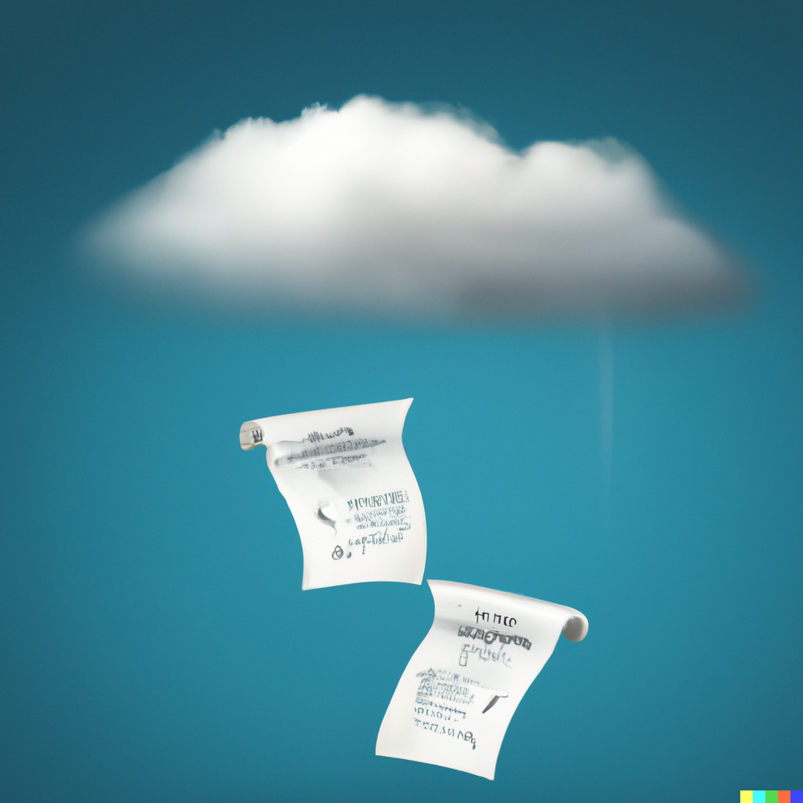

# AWS Reference Notes

<figure>

I used to have a running joke with colleagues that any part of the aws documentation that started with a **Note** was simply footgun waiting to blow up. 

These footguns came in the form of technical considerations, exceptions, and caveats that would take anywhere between an hour or a month to work around. 

Some examples:
- when provisioning anything via cloudformation/cdk/terraform, reverse engineering what IAM permissions, security groups, versions, and other settings needed to be in place to have a successful deployment
- service limits 
- cross account restrictions
- limitations when integrating different services
- caveats around emitted metrics

This is a compilation of all **Note-able** areas of the AWS Docs, extracted from the AWS public documentation.

I've started with just three AWS Services to make sure that the formatting and information is correct before expanding the scope to other services. 

## Layout

Each AWS Service has the following layout

```
- {service}
    - Common
    - Topics
```

- Common refers to docs common to all AWS services. The cover the following:
    - Getting Started
    - Monitoring
    - Security
    - Networking
    - Configuration
    - Troubleshooting
    - Resources and Tags
    - Working with other services
- Topics cover everything that is service specific. For example, `Lambda Runtimes` are unique to the Lambda service

## Contributing

This project is hot off the press as of 2023-05-14. 

All the notes in this project are auto-generated from [aws-doc-extractor](https://github.com/kevinslin/aws-doc-extractor)
See the repo for instructions on contributing. Feel free to also report any issues or feature request in this repo.  

You can see the [roadmap](https://github.com/users/kevinslin/projects/3/views/1) to see upcoming changes. 
